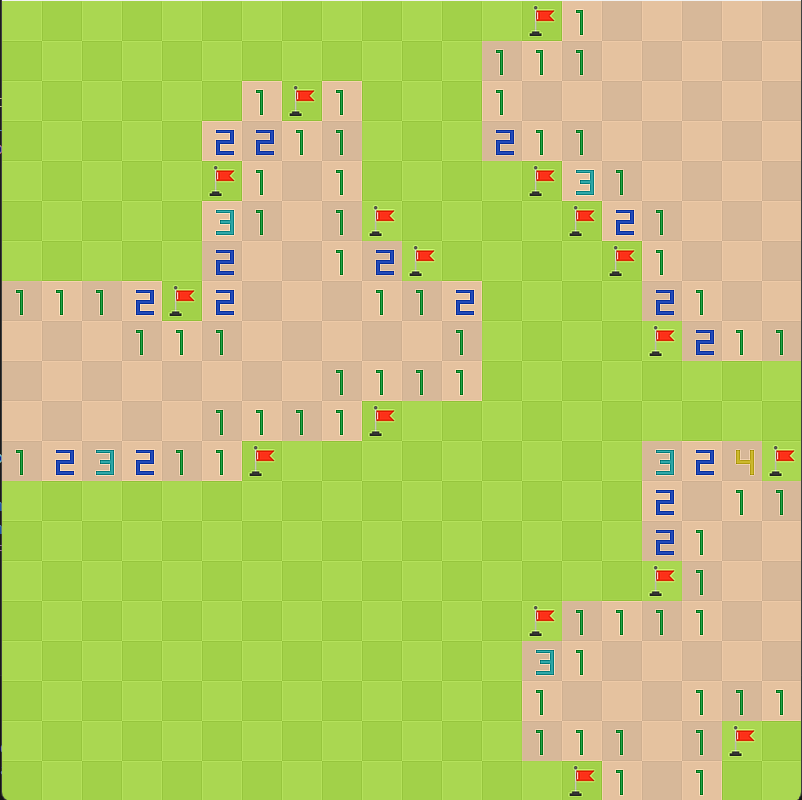

# Minesweeper
This is my take on the classic **Minesweeper** game and also my first game project. Built using **Raylib**, it offers a clean interface and engaging gameplay.



## Table of Contents

- [Features](#features)
- [Getting Started](#getting-started)
  - [Prerequisites](#prerequisites)
  - [Installation Guide](#installation-guide)
- [Running the Game](#running-the-game)
  - [Using VSCode](#using-vscode)
  - [Using the Command Line](#using-the-command-line)
- [Controls](#controls)
- [Contributing](#contributing)
- [License](#license)

## Features

- Classic Minesweeper gameplay
- Customizable difficulty levels (planned feature)

## Getting Started

### Prerequisites

- **Raylib**: Download from [raylib.com](https://www.raylib.com)
- **Visual Studio Code** (VSCode)
- **C++ Compiler**: Ensure you have GCC, Clang, or MSVC installed

## Installation Guide

### Step 1: Install Git
If you don't have Git installed, download and install it from [git-scm.com](https://git-scm.com/).

### Step 2: Clone the Repository
1. Open **Visual Studio Code**.
2. Open the terminal in Visual Studio Code by pressing ``Ctrl+` `` (backtick) or by navigating to `View > Terminal`.
3. Clone the repository using the following command:
    ```sh
    git clone https://github.com/Tungnghuu/minesweeper.git
    ```

### Step 3: Install Raylib
1. Download **Raylib** from [raylib.com](https://www.raylib.com/).
2. Follow the installation instructions for your operating system.

### Step 4: Open the Project in Visual Studio Code
1. Open **Visual Studio Code**.
2. Click on `File > Open Folder...` and select the folder where you cloned your repository.

### Step 5: Build and Run the Project
#### Using VSCode
1. To build the project, press `Ctrl+Shift+B` and select either `build debug` or `build release`.
2. To debug the project, press `F5` and select the `Debug` configuration.
3. To run the project without debugging, press `Ctrl+F5` and select the `Run` configuration.

#### Using the Command Line
1. Open a terminal or command prompt.
2. Navigate to the project directory:
    ```sh
    cd path/to/minesweeper
    ```
3. Build the project:
    - For debug build:
        ```sh
        make PLATFORM=PLATFORM_DESKTOP BUILD_MODE=DEBUG
        ```
    - For release build:
        ```sh
        make PLATFORM=PLATFORM_DESKTOP
        ```
4. Run the project:
    - For debug build:
        ```sh
        ./minesweeper_debug
        ```
    - For release build:
        ```sh
        ./minesweeper
        ```

### Step 6: Enjoy the Game
You should now be able to build, run, and debug your Minesweeper game project in **Visual Studio Code** or using the command line.

## Controls

- **Left Click**: Reveal a tile
- **Right Click**: Flag or unflag a tile

## License

This project is licensed under the MIT License. See the `LICENSE` file for details.